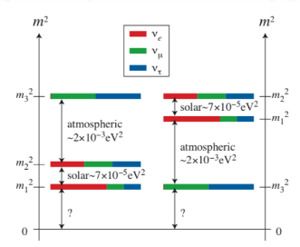
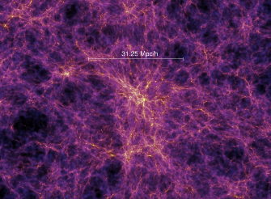
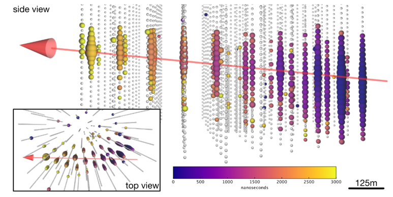
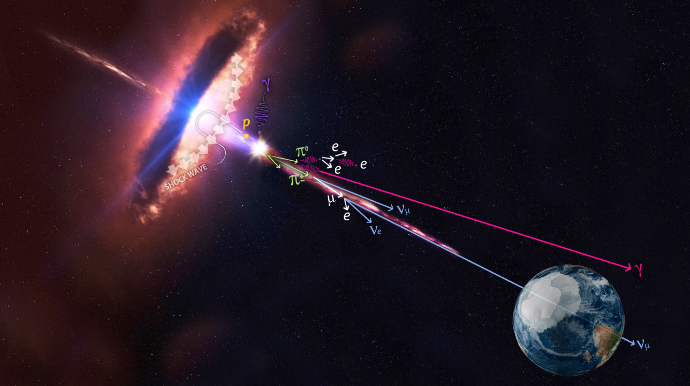
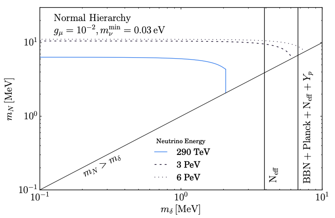

# Neutrinos at IceCube

> Some motivated models of dark matter involve couplings to neutrinos which are often introduced to generate the experimentally observed non-zero neutrino mass. These couplings can affect the propagation of neutrinos across cosmological distances. We look to use data from the IceCube experiment to constrain such models and give an outlook for future observations.

This post is based on an article written in February 2019 with colleagues at King's College London. Links to the webpages and PDF documents can be found below. Also included is a link to a presentation given by myself at the recent BUSSTEPP Summer School at the University of Glasgow.

### Linking Scalar Dark Matter and Neutrino Masses with IceCube 170922A, *J. Alvey, M. Fairbairn*

*Abstract:* Two of the key unresolved issues facing Standard Model physics are (i) the appearance of a small but non-zero neutrino mass, and, (ii) the missing mass problem in the Universe. The focus of this paper is a previously proposed low energy effective theory that couples a dark scalar to Standard Model neutrinos. This provides a stable dark matter candidate as well as radiatively generating a neutrino mass. Within this framework we will then construct an entirely new bound from the IceCube-170922A event which takes into account (i) the possible neutrino mass hierarchies, (ii) the effect of cosmological redshift on e.g. the number density of cosmic neutrino background neutrinos, and, (iii) the non-degeneracy of neutrino mass and flavour eigenstates. This builds on work by Kelly and Machado (2018), where the authors placed new constraints on neutrinophilic and axion dark matter models. At low mediator masses, we find an improvement of an order of magnitude on current constraints from kaon decays. The constraint is complimentary (and slightly weaker) than current constraints from Big Bang Nucleosynthesis and the Cosmic Microwave Background. We explore how future higher energy events could improve this bound.

* <a href="https://arxiv.org/pdf/1902.01450.pdf" target="blank_"><i class="fa fa-file-pdf-o" aria-hidden="true"></i> PDF</a> 

* <a href="http://inspirehep.net/record/1718572" target="blank_"><i class="fa fa-external-link" aria-hidden="true"></i> Inspire-HEP Record</a>

## Neutrino Masses and Dark Matter

Observations of neutrino oscillations at experiments such as Super-Kamiokande indicate that neutrinos do indeed have a small but non-zero mass. This is in conflict with the Standard Model of particle physics where the neutrinos are strictly massless. There are a number of things to be discovered about these particles including their precise masses and the hierarchy that exists between them (normal or inverted).

Another key issue is the nature of Dark Matter. It is not yet clear whether particle Dark Matter is indeed realised in nature, however there are motivated models that link this missing mass issue and the non-zero nature of neutrino masses. In this work, we consider an effective theory proposed by Farzan and Ma that radiatively generates neutrino masses, whilst also providing a dark matter candidate in the particle spectrum.

## Neutrino Propagation

Within the Standard Model, neutrinos have a mean free path - the average distance travelled before an interaction takes place - that is very large, even on cosmological scales. On the other hand, if new particles are introduced such as the one mentioned above, this mean free path could be altered due to resonant interactions between the neutrinos and the Cosmic Neutrino Background.

If this is indeed the case, then observations of neutrinos from a very far away source allow us to place constraints on such models with the condition that the calculable mean free path must be greater than the source distance.

## IceCube and TXS 0506+056

The IceCube neutrino observatory is a relatively new facility located at the South Pole. It consists of a Cherenkov detector that allows us to reconstruct high energy neutrino events. Importantly, it can provide an estimate of not just the energy of the neutrino, but also the trajectory. Combined with data from satellites such as FermiLAT, this makes it possible to localise a source.

In our case, we are interested in a source of high energy neutrinos which has likely been localised to the blazar TXS 0506+056. On 22nd September 2017, IceCube announced the detection of a 290 TeV neutrino which is believed to be from the blazar. This is the event we use to constrain the model.

## Conclusions

To summarise, we are able to constrain new physics within the neutrino sector using observations from the IceCube experiment. We can also look to future observations of high energy neutrinos and deduce the bounds we would expect if they were to be from a source at a similar distance. These are shown in the plot below for the masses of the two new particles in the spectrum. We also compare to CMB and BBN bounds.

## Links

Links to the relevant papers and websites can be found below,

* <a href="https://arxiv.org/pdf/1902.01450.pdf" target="blank_"><i class="fa fa-file-pdf-o" aria-hidden="true"></i> PDF</a> 

* <a href="http://inspirehep.net/record/1718572" target="blank_"><i class="fa fa-external-link" aria-hidden="true"></i> Inspire-HEP Record</a>
